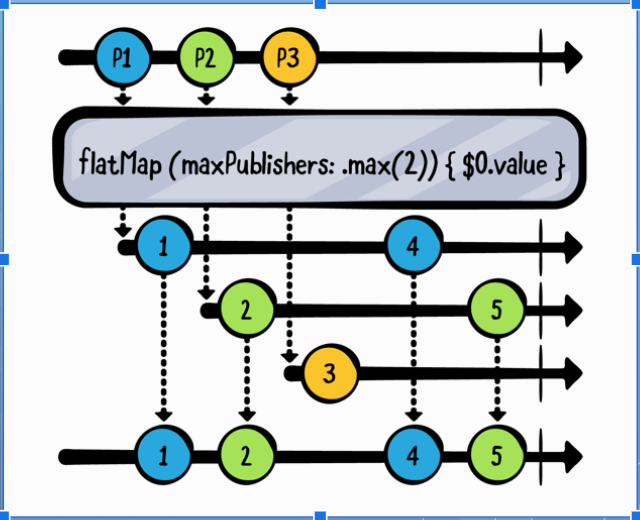
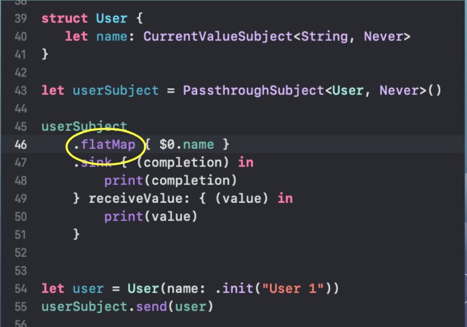
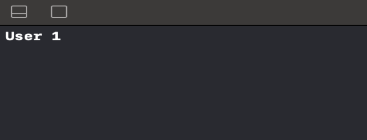
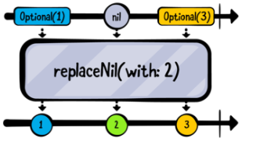
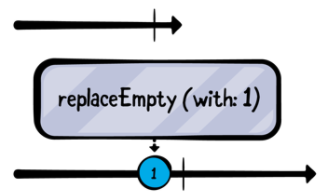
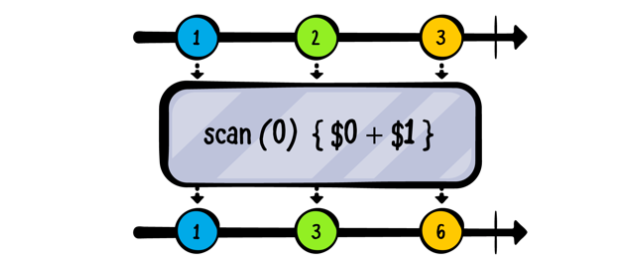

**Transforming Oprators**

> Mọi chia sẻ hay sao chép phải được cấp phép, tác quyền thuộc team iOS - Asian Tech, Inc

# Contents

1. [Collecting values](#collecting_values)
    1. [Collect()](#collect())
    2. [Collect(n)](#Collect(n))
    
2. [Mapping values](#mapping_values)
    1. [Reactive](#Reactive)
    2. [Observable và Observer](#Observable-Observer)
    3. [Operator - man in the middle](#Operator-man-in-the-middle)
    4. [Subjects](#Subjects)

3. [Flattening publishers](#flattening_publishers)
    1. [Reactive](#Reactive)
    2. [Observable và Observer](#Observable-Observer)
    3. [Operator - man in the middle](#Operator-man-in-the-middle)
    4. [Subjects](#Subjects)

4. [Replacing upstream output](#replacing_upstream_output)
    1. [replaceNil(with:)](#replaceNil)
    2. [replaceEmpty(with:)](#replaceEmpty)

5. [Incrementally transforming output](#incrementally_transforming_output)
    1. [Reactive](#Reactive)
    2. [Observable và Observer](#Observable-Observer)
    3. [Operator - man in the middle](#Operator-man-in-the-middle)
    4. [Subjects](#Subjects)

## 1. Collecting values <a name="collecting_values"></a>

**Collecting values là gì?**

 -  **là operator liên quan tới collecting các giá trị phát ra, tổng hợp lại và xử lý 1 lần nhiều giá trị**

    **Cách dùng lấy publisher và gọi function sau: .collect() hay .collect(n) (n là một giá trị cụ thể nào đó)**.
    ### 1.1 collect()<a name="collect()"></a>
    ```swift
    public func collect() -> Result<[Publishers.Sequence<Elements, Failure>.Output], Failure>.Publisher
    ```

  **Ví dụ bằng code swift: không dùng collect()**

  ```swift
  [0,1,2,3].publisher
    .sink { (output) in 
    print(output)
}.store(in: &subscriptions)
  ```

  ```swift
  //0
  //1
  //2
  //3
  Completed
  ```
  **Ví dụ bằng code swift: không dùng collect()**

  ```swift
  [0,1,2,3].publisher
    .collect()
    .sink { (output) in 
    print(output)
}.store(in: &subscriptions)
  ```

  ```swift
  // [0,1,2,3]
  Completed
 ```

- **"“Note: Be careful when working with collect() and other buffering operators that do not require specifying a count or limit. They will use an unbounded amount of memory to store received values.”**

**tổng hợp một số lượng cụ thể của các element phát ra, và sau đó phát ra array đó **

### 1.2 collect(n)<a name="collect(n)"></a>

```swift
public func collect(_ count: Int) -> Result<[Publishers.Sequence<Elements, Failure>.Output], Failure>.Publisher
```
**Ví dụ bằng code swift: không dùng collect(n)**

```swift
.sink { (completion) in
        print(completion)
    } receiveValue: { (values) in 
        print(values)
    }
(0...10).forEach({
    passthoughSubject.send($0)
})
passthoughtSubject.send(completion: .finished)
```

```swift
[0, 1, 2]
[3, 4, 5]
[6, 7, 8]
[9, 10]
finished
```
## 2. Mapping values <a name="mapping_values"></a>

### 2.1 Map <a name="map"></a>
Xem đoạn code sau và hình dung
``` var subscriptions = Set<AnyCancellable>()
let formatter = NumberFormater()
formatter.numberStyle = .spellOut
[22, 7, 1989].publisher
.map {
formatter.string(for: NSNumber(integerLiteral: $0)) ?? "" }
.sink(receiveValue: { print($0) })
.store(in: $subscriptions)
```
Giải thích
- Tạo ra một formatter của Number. Nhiệm vụ nó là biến đổi từ số thành chữ
- Tạo ra 1 publisher từ một array Integer
- Sử dụng toàn tử .map để biến đổi tường giá trị nhận được thành kiểu string
- Các toàn tử còn lại thì như đã trình bày các phần trước

>Toán tử `map` giúp biến đổi kiểu giá trị Output của Publisher

### 2.2 Map key paths <a name="map_key_paths"></a>
Bổ sung cho toán tử `map` trên thì Combine hỗ trợ cho chúng ta thêm 3 function của nó như sau:
``` map<T>(_:)
map<T0, T1>(_:_:)
map<T0, T1, T2>(_:_:_:)
```
Thay vì tấn công biến đổi chính đối tượng khi nó là Output của 1 publisher nào đó. Thì ta có thể biến đổi trong publisher đó thành một publisher khác. Mà phát ra kiểu giá trị mới, chính là kiểu giá trị của 1 trong các thuộc tính đối tượng. Xem ví dụ đi cho chắc.

``` struct Dog {
    var name: String
    var age: Int
}

let publisher = [Dog(name: "MiMi", age: 3), 
                Dog(name: "MiMi", age: 3), 
                Dog(name: "MiMi", age: 3), 
                Dog(name: "MiMi", age: 3)].publisher
                
publisher
    .map(\(.name)
    .sink(receiveValue: { print($0) })
    .store(in: &subscroptions)
```

Giải thích
- Ta có class Dog
- Tạo 1 publisher từ việc biến đổi 1 Array Dog. Lúc này Output của publisher là Dog
- Sử dụng `map(\.name)` để tạo 1 publisher mới với Output là String. String là kiểu dữ liệu cho thuộc tính `name` của class Dog
- sink và store như bình thường

### 2.3 tryMap <a name= "tryMap"></a>
Khi bạn làm những việc liên quan tới nhập xuất, kiểm tra, media, file... thì hầu như phải sử dụng `try catch` nhiều. Nó giúp cho việc đảm bảo chương trình của bạn không bị crash. Tất nhiên, nhiều lúc bạn phải cần biến đổi từ kiểu giá trị này tới một kiểu giá trị mà có khả năng sinh ra lỗi. Khi đó bạn hãy dùng `tryMap` như một cứu cánh.

Khi gặp lỗi trong quá trình biến đổi thì tự động cho vào `completion` hoặc `error`. Bạn vẫn có thể quản lí nó và không cần quan tâm gì tới bắt `try catch` ...

``` Just("Đây là đường dẫn tới file media")
        .tryMap { try FileManager.default.contentsOfDirectory(atPath: $0) }
        .sink(receiveCompletion: { print("Finished ", $0)}, 
            receiveValue: { print("Value ", $0)})
        .store(in: &subscription)
```

Giải thích
- Just là 1 publisher, sẽ phát ra ngay giá trị khởi tạo
- Sử dụng `tryMap` để biến đổi Output là `string` (hiểu là đường dẫn của 1 file nào đó) thành đổi tượng là `file`(data)
- Trong closure của `tryMap` thì tiến hành đọc file với đường dẫn kia
- Nếu có lỗi thì sẽ nhận được `completion` với trị là `failure`
>>>>>>> topic/transforming_operators

#### [Creation](docs/Deep-dive/Creation.md)
#### [Operators](docs/Deep-dive/Operators)
#### [MVVM](docs/Deep-dive/MVVM.md)

## 3. Flattening publishers <a name="flattening_publishers"></a>

## 4. Replacing upstream output <a name="replacing_upstream_output"></a>
Phần này sẽ tập trung vào implement Unit-Testing bằng các framework trên RxSwift Community như `RxTests`, `RxBlocking`, `RxNimble`

### 4.1. [RxTests](docs/Testing.md) <a name="RxTests"></a> 

### 4.2. RxNimble <a name="RxNimble"></a> (Update later)
[Tài liệu](https://developer.apple.com/documentation/combine/publishers/flatmap)

Chuyển đổi tất cả các yếu tố từ nhà xuất bản ngược dòng thành nhà xuất bản mới với số lượng nhà xuất bản tối đa mà bạn chỉ định.




Sử dụng:
- Thường được sử dụng để làm phẳng giá trị nhận được.


Ví dụ:




Kêt quả:




## 4. Replacing upstream output <a name="replacing_upstream_output"></a>

### 4.1. replaceNil(with:) <a name="replaceNil"></a> 

replaceNil: nếu publisher phát ra giá trị nào nil thì sẽ thay thế bằng giá trị nào đó được chỉ định. 



Ví dụ:

```swift
let publisher = [1, nil, 3].publisher
publisher.replaceNil(with: 2)
    .sink { completion in
        print(completion)
    } receiveValue: { value in
        if let value = value {
            print(value)
        }
    }
```

Kết quả:
1
2
3
finished

### 4.2. replaceEmpty(with:) <a name="replaceEmpty"></a>

replaceEmpty: Toán tử replaceEmpty sẽ chèn thêm giá trị nếu publisher không phát đi bất cứ gì mà lại complete.



Ví dụ:

```swift
let empty = Empty<Int, Never>()

empty
    .replaceEmpty(with: 1)
    .sink { completion in
        print(completion)
    } receiveValue: { value in
        print(value)
    }
```

Kết quả:
1
finished
>>>>>>> topic/transforming_operators

## 5. Incrementally transforming output <a name="incrementally_transforming_output"></a>

Phần này chúng ta sẽ nói về `scan` và  `tryScan` là 2 opearators cho phép ta biến đổi từng phần tử upstream publisher theo một closure tự ta định nghĩa. Với `tryScan` ta có làm việc với closure nào có thể trả về lỗi.

- Đây là 2 function của nó
``` swift
public func scan<T>(_ initialResult: T, _ nextPartialResult: (T, Output) -> T) -> Result<T, Just<Output>.Failure>.Publisher

public func tryScan<T>(_ initialResult: T, _ nextPartialResult: (T, Output) throws -> T) -> Result<T, Error>.Publisher
```

Parameters
- initialResult:
Là kết quả trước được trả về bởi closure nextPartialResult.
-  nextPartialResult: 
Là một closure có thể trả về lỗi hoặc không, closure cung cấp cho ta 2 tham số là giá trị được closure trả về trước đó và giá trị tiếp theo được phát từ upstream publisher.

## Lý thuyết chỉ có nhiêu đó ta có thể tham khảo một số demo phía dưới để xem hắn hoạt động như thế nào:

### 5.1. scan <a name="scan"></a> 

#### 5.1.1. Ví dụ 1 
- Ví dụ này `scan` bắt đầu việc lưu bắt đầu là 0. Nó sẽ nhận mỗi giá trị từ publisher rồi cộng với giá trị đã lưu trước đó và sau đó lưu giá trị rồi phát nó đi.

Để dễ hình dung thì ta có thể xem hình bên dưới :))



Code
``` swift
(0...10).publisher
    .scan(0, { $0 + $1 })
    .sink { (value) in
        print("\(value)", terminator: " ")
    }
```
- Khởi tạo với giá trị ban đầu là 0, sau khi nhận giá trị từ publisher thì sẽ cộng với giá trị được closure trả về trước đó. ( Để dễ hiểu thì do lần đầu tiên chưa chạy closre nên ta phải khởi tạo giá trị là 0 đó:>>)
- `terminator` thì để in ra trên một dòng thôi.

Ta có thể thấy sự thay đổi giá trị qua hình bên dưới:


Kết quả:
```
0 1 3 6 10 15 21 28 36 45 55 100
```

#### 5.1.2. Thêm một ví dụ về việc sử dụng `scan`:

Ví dụ nói về việc thối tiền, mục tiêu là đưa ra ít tờ tiền nhất.>>

``` swift
extension Int {
    var moneyFormater: String {
        let formatter = NumberFormatter()
        formatter.numberStyle = .currencyAccounting
        return formatter.string(from: NSNumber(value: self))!
    }
}
```
Cái `extension` này để formater ra theo số mệnh giá tiền cho nhanh thôi, code chính vẫn ở bên dưới :)) 

``` swift
var subscriptions = Set<AnyCancellable>()
let typeOfMoneys = [500_000, 200_000, 100_000, 50_000, 20_000, 10_000, 5_000, 2_000, 1_000]
    .sorted(by: { $0 > $1 })
    .publisher

var output: [(Int, String)] = []    // Là số tờ của từng mệnh giá cần thối lại cho khách hàng
let input: Int = 1_023_000          // Số tiền khách đưa
let bill: Int = 1_000               // Số tiền khách phải trả

typeOfMoneys
    .scan(input - bill, {
        if $0 < $1 {
            return $0
        }
        output.append(($0 / $1, "\($1.moneyFormater)"))
        return $0 % $1
    })
    .sink { (completion) in
        print("\n\n", output)
    } receiveValue: { (value) in
        print(" \(value)", terminator: " ")
    }.store(in: &subscriptions)
```
- Đầu tiên để đưa lại ít tờ tiền cho khách hàng nhất thì phải sắp xếp mệnh giá từ cao xuống thấp.
- Giá trị khởi tạo ban đầu chính là số tiền phải thối lại cho khách hàng = input - bill
- Closure lúc này sẽ trả về số tiền còn lại phải đưa cho khách hàng.
- Nếu số tiền còn lại phải thối bé hơn mệnh giá của tiền (được nhânh từ publisher) thì sẽ trả về số tiền còn lại lúc trước được closure trả về. Còn nếu không thì sẽ lưu vào mảng output số tờ và mệnh giá tiền. Tiếp tục cần trả về số tiền còn lại sau khi trừ đi số tiền đã lưu.

Kết quả:
``` swift
 22000  22000  22000  22000  2000  2000  2000  0  0     // Sự thay đổi của việc tính toán

 [(2, "$500,000.00"), (1, "$20,000.00"), (1, "$2,000.00")]
```

### 5.2. tryScan <a name="RxNimble"></a>
Một ví dụ về việc dùng `tryScan`:

Code:
``` swift
enum DError: Error {
    case divisionByZeroError
}

[10, 8, 9, 0, 5, 6].publisher
    .tryScan(100, {
        if $1 == 0 {
            throw DError.divisionByZeroError
        }
        return $0 / $1
    })
    .sink { (completion) in
        print(completion)
    } receiveValue: { (value) in
        print("\(value)", terminator: " ")
    }
```
- Ở ví dụ trên thì khởi tạo giá trị ban đầu là 100, mỗi khi nhận được phần tử từ publisher bằng 0 thì sẽ kết thúc với một lỗi. Còn không thì sẽ trả về thương của giá trị mà closure trả về lúc trước và giá trị nhận từ publisher hiện tại.
- Hắn dùng thì cũng giống `scan` thôi chỉ khác là khi mà closure trả về một lỗi thì publisher sẽ kết thúc với lỗi đó luôn. Ta có thể xem kết quả bên dưới.


Kết quả:
```
10 1 0 failure(__lldb_expr_7.DError.divisionByZeroError)
```


# Hết roài :))!!
